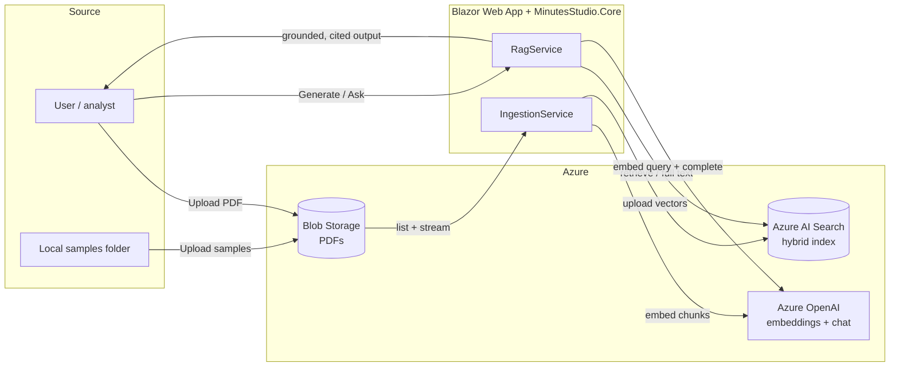

# Minutes Studio

A prototype **Retrieval-Augmented Generation (RAG)** application that ingests meeting-minute PDFs and
generates grounded, cited analyst **work products** — plus a free-form **document chat** — using
Azure OpenAI and Azure AI Search.

It is purpose-built for **meeting minutes from congressional committee meetings** — the domain shapes
the whole app: work products are the kinds of deliverables a committee/legislative-affairs team
produces (stakeholder briefs, executive talking points, plain-language summaries), and bills and
nominations mentioned in the minutes (e.g. `S.3018`, `H.R.260`, `PN893`) are automatically linked to
[congress.gov](https://www.congress.gov), resolved to the correct Congress from the meeting date.

Everything the model produces is grounded in the source documents and cited back to the specific
meeting (and page range), so answers stay traceable and free of fabrication.

---

## Features

- **Work Products** — one-click generation from selected documents:
  - Stakeholder Brief
  - Executive Talking Points
  - Plain-Language Summary
  - Meeting Summary
- **Document Chat** — free-form Q&A across all documents (or scoped to one), with hybrid retrieval.
- **Single vs. all meetings** — single-meeting generation uses the document's *full text*; "all
  meetings" uses a **map-reduce** pipeline to avoid cross-meeting fact bleed.
- **Grounded citations** — click a citation to open a side panel with the source excerpt.
- **Congress.gov linking** — detected bills/nominations (e.g. `S.3018`, `PN893`) are linked to
  `congress.gov`, resolved to the correct Congress from the meeting date, and only linked when
  grounded in the source.
- **Tone / length / reference controls** — adjust output style and choose whether references are
  included, hidden, or stripped for a clean, email-safe copy.
- **Token accounting** — input/output/total token usage surfaced per generation.
- **Document management** — list, preview (inline PDF), upload, and (re)index PDFs in Blob Storage.
- **Health preflight** — checks embeddings, chat, and search connectivity before you ingest.

---

## Tech stack

- **.NET 8**, ASP.NET Core **Blazor Web App** (Interactive Server) — `MinutesStudio.Web`
- **RAG core** class library — `MinutesStudio.Core`
- **Azure OpenAI** (Azure AI Foundry) — `gpt-5.4-mini` (chat) + `text-embedding-3-large` (3072-dim embeddings)
- **Azure AI Search** — hybrid (BM25 + HNSW vector) index
- **Azure Blob Storage** — source PDFs
- **UglyToad.PdfPig** — PDF text extraction · **Markdig** — Markdown rendering

---

## Repository structure

```
.
├── MinutesStudio.sln
├── docs/
│   └── data-architecture.md        # Detailed data flow + Mermaid diagrams
├── samples/                        # Sample meeting-minute PDFs
└── src/
    ├── MinutesStudio.Core/         # RAG logic (no UI dependencies)
    │   ├── Configuration/          # Options: AzureOpenAI, AzureSearch, AzureBlob, Rag
    │   ├── Models/
    │   ├── Prompts/                # PromptLibrary + grounding rules
    │   └── Services/               # Ingestion, embeddings, search, generation, RAG, etc.
    └── MinutesStudio.Web/          # Blazor UI + minimal JSON API
        ├── Components/             # Pages, layout, ReferencePanel
        └── wwwroot/
```

---

## Architecture



See [`docs/data-architecture.md`](docs/data-architecture.md) for the full ingestion pipeline,
map-reduce generation, index model, and resilience details. The doc is also viewable in-app on the
**Architecture** page.

---

## Prerequisites

- [.NET 8 SDK](https://dotnet.microsoft.com/download/dotnet/8.0)
- An **Azure OpenAI (Azure AI Foundry)** resource with two deployments:
  - a chat model (default deployment name `gpt-5.4-mini`)
  - `text-embedding-3-large` (embeddings)
- An **Azure AI Search** service (Basic tier or higher; needs an admin key or RBAC).
- An **Azure Blob Storage** account with a container for the source PDFs.

---

## Configuration

Non-secret defaults (deployment / index / container names, chunking) live in
`src/MinutesStudio.Web/appsettings.Development.json`. **Secrets are never committed** — set them via
[.NET user-secrets](https://learn.microsoft.com/aspnet/core/security/app-secrets).

```bash
cd src/MinutesStudio.Web

# Azure OpenAI (Foundry)
dotnet user-secrets set "AzureOpenAI:Endpoint" "https://<your-foundry>.services.ai.azure.com/"
dotnet user-secrets set "AzureOpenAI:ApiKey"   "<your-aoai-key>"

# Azure AI Search
dotnet user-secrets set "AzureSearch:Endpoint" "https://<your-search>.search.windows.net"
dotnet user-secrets set "AzureSearch:ApiKey"   "<your-search-admin-key>"

# Azure Blob Storage
dotnet user-secrets set "AzureBlob:ConnectionString" "<your-storage-connection-string>"
```

### Configuration keys

| Section | Keys |
| --- | --- |
| `AzureOpenAI` | `Endpoint`, `ApiKey` *(secret)*, `ChatDeployment`, `EmbeddingDeployment`, `EmbeddingDimensions` |
| `AzureSearch` | `Endpoint`, `ApiKey` *(secret)*, `IndexName` |
| `AzureBlob` | `ConnectionString` *(secret)*, `ContainerName` |
| `Rag` | `ChunkSizeChars`, `ChunkOverlapChars`, `TopK`, `SamplesPath` |

> If an API key / connection string is left empty, the app falls back to `DefaultAzureCredential`
> (managed identity / `az login`), which is the preferred path for an Azure deployment.

---

## Running locally

```bash
cd src/MinutesStudio.Web
dotnet run
```

Then open **http://localhost:5190** (the default `http` launch profile, which sets the Development
environment so your user-secrets load).

### First run — load and index documents

1. Go to the **Documents** page.
2. **Upload samples** (seeds Blob Storage from the local `samples/` folder) or upload your own PDFs.
3. Click **Ingest** to extract → chunk → embed → index the PDFs.
4. Head to **Work Products** or **Chat** and start generating.

> The Azure AI Search index prefix is `minutesstudio-minutes`. Resetting the index creates a new
> timestamped index and cleans up the old ones automatically.

---

## HTTP API

A lightweight JSON API is exposed for automation and scripting:

| Method & path | Purpose |
| --- | --- |
| `POST /api/ingest?reset=true` | Run the ingestion pipeline (reset rebuilds the index) |
| `POST /api/blob/upload-samples` | Seed Blob Storage from the local samples folder |
| `GET /api/blob/preview?name=<blob>` | Stream a PDF inline |
| `GET /api/workproduct?type=<type>&sourceFile=<file>&tone=&length=&references=` | Generate a work product |
| `GET /api/ask?q=<question>&sourceFile=<file>` | Ask a grounded question |
| `GET /api/health` | Preflight check of embeddings, chat, and search |

`type` accepts the work-product names (e.g. `StakeholderBrief`, `ExecutiveTalkingPoints`,
`PlainLanguageSummary`, `MeetingSummary`). `references` accepts `Included`, `Hidden`, or `Clean`.

---

## Prompt design

The four work-product prompts and the shared **grounding rules** (injected into every prompt and the
chat assistant) are defined in `MinutesStudio.Core/Prompts/PromptLibrary.cs` and are viewable in-app on
the **Prompt Library** page. Each template is annotated with the key design decisions behind it.

---

## Resilience notes

- **Transient-fault retry** with exponential backoff wraps embedding and chat calls (treats
  `408/429/5xx`, network errors, and intermittent `404 DeploymentNotFound` as transient).
- The Azure OpenAI client API version is pinned to `2024-10-21`.
- SDK exceptions are mapped to actionable messages (auth / missing / throttled / transient).

---

## Roadmap

- **Entra ID** authentication on the app + **managed identity** to Azure OpenAI, Search, and Blob
  (removing API keys entirely).
- Azure deployment (App Service / Container Apps).

---

## Status

Prototype built for evaluation. Not production-hardened — secrets are local user-secrets and the auth
model is key-based pending the Entra/managed-identity work above.

---

## License

Released under the [MIT License](LICENSE).
