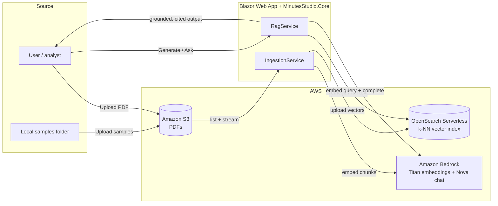

# Minutes Studio

A prototype **Retrieval-Augmented Generation (RAG)** application that ingests meeting-minute PDFs and
generates grounded, cited analyst **work products** — plus a free-form **document chat** — using
**Amazon Bedrock** and **Amazon OpenSearch Serverless**.

It is purpose-built for **meeting minutes from congressional committee meetings** — the domain shapes
the whole app: work products are the kinds of deliverables a committee/legislative-affairs team
produces (stakeholder briefs, executive talking points, plain-language summaries), and bills and
nominations mentioned in the minutes (e.g. `S.3018`, `H.R.260`, `PN893`) are automatically linked to
[congress.gov](https://www.congress.gov), resolved to the correct Congress from the meeting date.

Everything the model produces is grounded in the source documents and cited back to the specific
meeting (and page range), so answers stay traceable and free of fabrication.

---

## Features

- **Work Products** — one-click generation from selected documents:
  - Stakeholder Brief
  - Executive Talking Points
  - Plain-Language Summary
  - Meeting Summary
- **Document Chat** — free-form Q&A across all documents (or scoped to one), with hybrid retrieval.
- **Single vs. all meetings** — single-meeting generation uses the document's *full text*; "all
  meetings" uses a **map-reduce** pipeline to avoid cross-meeting fact bleed.
- **Grounded citations** — click a citation to open a side panel with the source excerpt.
- **Congress.gov linking** — detected bills/nominations (e.g. `S.3018`, `PN893`) are linked to
  `congress.gov`, resolved to the correct Congress from the meeting date, and only linked when
  grounded in the source.
- **Tone / length / reference controls** — adjust output style and choose whether references are
  included, hidden, or stripped for a clean, email-safe copy.
- **Token accounting** — input/output/total token usage surfaced per generation.
- **Document management** — list, preview (inline PDF), upload, and (re)index PDFs in Amazon S3.
- **Health preflight** — checks embeddings, chat, and search connectivity before you ingest.

---

## Tech stack

- **.NET 8**, ASP.NET Core **Blazor Web App** (Interactive Server) — `MinutesStudio.Web`
- **RAG core** class library — `MinutesStudio.Core`
- **Amazon Bedrock** — Amazon Nova (chat, via the **Converse** API) + Amazon Titan Text Embeddings v2 (1024-dim)
- **Amazon OpenSearch Serverless** — k-NN (HNSW) vector index; hybrid retrieval via client-side Reciprocal Rank Fusion (BM25 + vector)
- **Amazon S3** — source PDFs
- **UglyToad.PdfPig** — PDF text extraction · **Markdig** — Markdown rendering

Auth uses the standard **AWS credential chain** (environment variables, shared profile, or an IAM role) — no keys are stored in the app.

---

## Repository structure

```
.
├── MinutesStudio.sln
├── docs/
│   └── data-architecture.md        # Detailed data flow + Mermaid diagrams
├── samples/                        # Sample meeting-minute PDFs
└── src/
    ├── MinutesStudio.Core/         # RAG logic (no UI dependencies)
    │   ├── Configuration/          # Options: Bedrock, OpenSearch, S3, Rag
    │   ├── Models/
    │   ├── Prompts/                # PromptLibrary + grounding rules
    │   └── Services/               # Ingestion, embeddings, search, generation, RAG, etc.
    └── MinutesStudio.Web/          # Blazor UI + minimal JSON API
        ├── Components/             # Pages, layout, ReferencePanel
        └── wwwroot/
```

---

## Architecture



See [`docs/data-architecture.md`](docs/data-architecture.md) for the full ingestion pipeline,
map-reduce generation, index model, and resilience details. The doc is also viewable in-app on the
**Architecture** page.

---

## Prerequisites

- [.NET 8 SDK](https://dotnet.microsoft.com/download/dotnet/8.0)
- An AWS account with **Amazon Bedrock model access enabled** (in the console → *Model access*) for:
  - a chat model — **Amazon Nova** (default `us.amazon.nova-pro-v1:0`)
  - **Amazon Titan Text Embeddings v2** (`amazon.titan-embed-text-v2:0`)
- An **Amazon OpenSearch** vector store — either a managed **OpenSearch Service** domain or a
  **Serverless** collection — with an access policy granting your identity read/write. The SigV4
  service code (`es` vs `aoss`) is auto-detected from the endpoint.
- An **Amazon S3** bucket for the source PDFs.
- AWS credentials available to the app via the standard chain (env vars, a shared profile, or an IAM
  role) with permissions for `bedrock:InvokeModel`, `aoss:APIAccessAll`, and S3 read/write on the bucket.

---

## Configuration

Non-secret defaults (model ids / index / bucket names, region, chunking) live in
`src/MinutesStudio.Web/appsettings.Development.json`. There are **no application secrets** — AWS
credentials come from the environment. Set the resource-specific values there (or via
[.NET user-secrets](https://learn.microsoft.com/aspnet/core/security/app-secrets)), at minimum the
OpenSearch collection endpoint and your S3 bucket name:

```bash
cd src/MinutesStudio.Web

dotnet user-secrets set "OpenSearch:Endpoint" "https://<domain-or-collection-endpoint>"
dotnet user-secrets set "S3:BucketName"       "<your-bucket>"
```

Provide AWS credentials the usual way, e.g.:

```bash
export AWS_REGION=us-east-1
export AWS_PROFILE=<your-profile>   # or AWS_ACCESS_KEY_ID / AWS_SECRET_ACCESS_KEY, or an IAM role
```

### Configuration keys

| Section | Keys |
| --- | --- |
| `Bedrock` | `Region`, `ChatModelId`, `EmbeddingModelId`, `EmbeddingDimensions`, `MaxOutputTokens` |
| `OpenSearch` | `Endpoint`, `Region`, `IndexName`, `ServiceCode` (optional; auto-detects `es` vs `aoss`) |
| `S3` | `BucketName`, `Region`, `Prefix` |
| `Rag` | `ChunkSizeChars`, `ChunkOverlapChars`, `TopK`, `SamplesPath` |

> All AWS access uses the standard credential chain (env vars / shared profile / IAM role). Prefer an
> IAM role in a deployed environment so no long-lived keys are needed.

---

## Running locally

```bash
cd src/MinutesStudio.Web
dotnet run
```

Then open **http://localhost:5190** (the default `http` launch profile, which sets the Development
environment so your user-secrets load).

### First run — load and index documents

1. Go to the **Documents** page.
2. **Upload samples** (seeds S3 from the local `samples/` folder) or upload your own PDFs.
3. Click **Ingest** to extract → chunk → embed → index the PDFs.
4. Head to **Work Products** or **Chat** and start generating.

> The OpenSearch index prefix is `minutesstudio-minutes`. Resetting the index creates a new
> timestamped index and cleans up the old ones automatically. (OpenSearch Serverless is near-real-time,
> so freshly-ingested counts may take a few seconds to appear.)

---

## HTTP API

A lightweight JSON API is exposed for automation and scripting:

| Method & path | Purpose |
| --- | --- |
| `POST /api/ingest?reset=true` | Run the ingestion pipeline (reset rebuilds the index) |
| `POST /api/blob/upload-samples` | Seed S3 from the local samples folder |
| `GET /api/blob/preview?name=<file>` | Stream a PDF inline from S3 |
| `GET /api/workproduct?type=<type>&sourceFile=<file>&tone=&length=&references=` | Generate a work product |
| `GET /api/ask?q=<question>&sourceFile=<file>` | Ask a grounded question |
| `GET /api/health` | Preflight check of embeddings, chat, and search |

`type` accepts the work-product names (e.g. `StakeholderBrief`, `ExecutiveTalkingPoints`,
`PlainLanguageSummary`, `MeetingSummary`). `references` accepts `Included`, `Hidden`, or `Clean`.

---

## Prompt design

The four work-product prompts and the shared **grounding rules** (injected into every prompt and the
chat assistant) are defined in `MinutesStudio.Core/Prompts/PromptLibrary.cs` and are viewable in-app on
the **Prompt Library** page. Each template is annotated with the key design decisions behind it.

---

## Resilience notes

- **Transient-fault retry** with exponential backoff wraps embedding and chat calls (treats
  `408/429/5xx`, network errors, and AWS throttling as transient) on top of the AWS SDK's own retries.
- Chat runs through the Bedrock **Converse** API, so the same code works across Nova, Claude, Llama,
  etc. — switch models by changing `Bedrock:ChatModelId`.
- SDK exceptions are mapped to actionable messages (access denied / missing / throttled / transient).

---

## Roadmap

- App-level authentication (e.g. Cognito) in front of the Blazor app.
- Server-side hybrid search via OpenSearch **search pipelines** where the collection supports them
  (today hybrid is done client-side with Reciprocal Rank Fusion).
- AWS deployment (ECS Fargate / App Runner) using an **IAM task role** for all AWS access.

---

## Status

Prototype built for evaluation. Not production-hardened. AWS access relies on the ambient credential
chain; use an IAM role with least-privilege permissions in any deployed environment.

---

## License

Released under the [MIT License](LICENSE).
