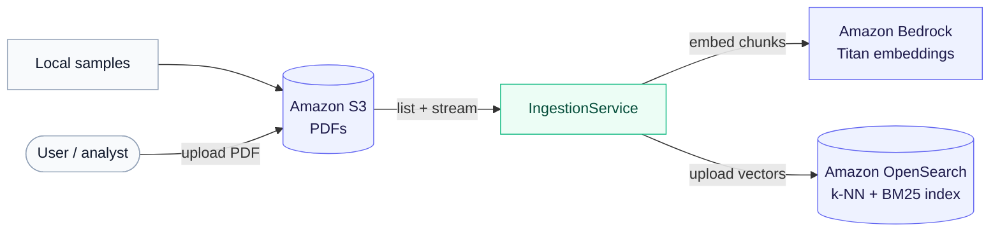
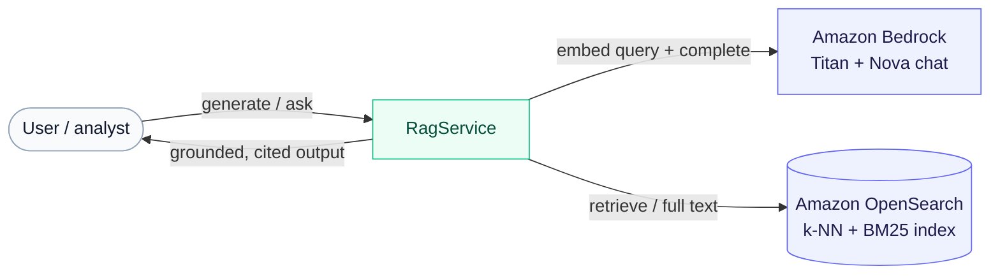
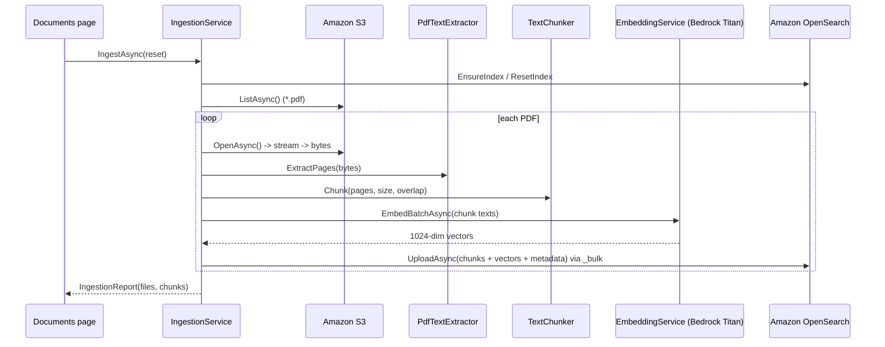
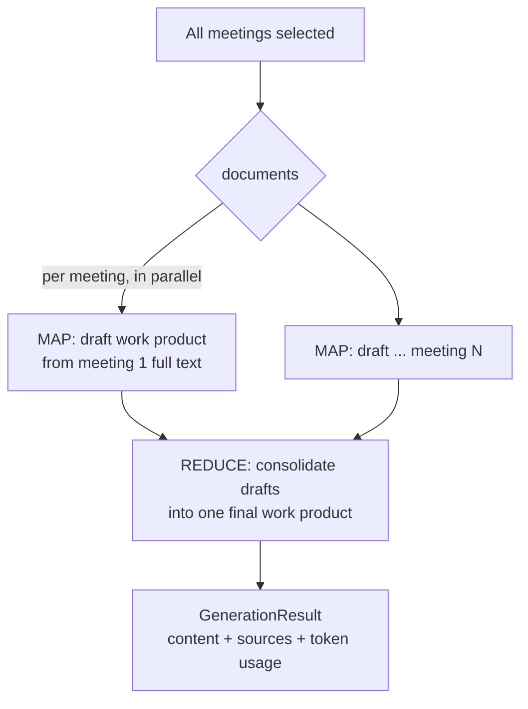
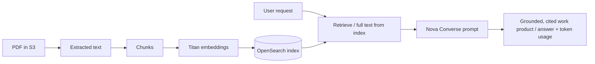

# Minutes Studio — Data Architecture

A prototype Retrieval-Augmented Generation (RAG) application that ingests meeting-minute PDFs and
generates analyst **work products** (stakeholder briefs, executive talking points, plain-language
summaries, meeting summaries) plus free-form **document chat**, all grounded in and cited back to the
source documents.

- **Frontend / host:** ASP.NET Core Blazor Web App (.NET 8, Interactive Server)
- **RAG logic:** `MinutesStudio.Core` class library
- **AI:** Amazon Bedrock — Amazon Nova (chat, via the Converse API) + Amazon Titan Text Embeddings v2
- **Vector store:** Amazon OpenSearch (managed Service domain *or* Serverless), k-NN + BM25
- **Document store:** Amazon S3 (source PDFs)

---

## 1. Services involved

### AWS services

| Service | Role | Notes |
| --- | --- | --- |
| **Amazon S3** | Source of truth for the raw PDFs | Bucket (e.g. `aws-minutes`); app can seed from local samples or accept uploads |
| **Amazon Bedrock** | Embeddings + text generation | `amazon.titan-embed-text-v2:0` (1024-dim) and Amazon Nova via the **Converse** API |
| **Amazon OpenSearch** | Vector + keyword index | k-NN (HNSW) vectors + BM25 keyword; index prefix `minutesstudio-minutes`. Works with a managed domain (`es`) or Serverless (`aoss`) |

Auth for all three uses the **AWS default credential chain** (environment variables, shared profile,
or an IAM role) — SigV4-signed requests, no keys stored in the app.

### Application services (`MinutesStudio.Core`)

| Service | Responsibility |
| --- | --- |
| `IBlobDocumentSource` / `S3DocumentSource` | List + stream PDFs from S3; upload samples / single files |
| `IPdfTextExtractor` / `PdfTextExtractor` | Extract page-by-page text from PDF bytes (PdfPig) |
| `ITextChunker` / `TextChunker` | Sliding-window chunking with overlap, preserving page ranges |
| `IEmbeddingService` / `BedrockEmbeddingService` | Embed text via Bedrock Titan (client-side concurrency) |
| `ISearchService` / `OpenSearchService` | Create/reset index, upload chunks, hybrid/vector query, list docs |
| `IGenerationService` / `BedrockGenerationService` | Chat completions via Converse; returns text **+ token usage** |
| `IIngestionService` / `IngestionService` | Orchestrates extract → chunk → embed → index |
| `IRagService` / `RagService` | Work-product generation (incl. map-reduce) and chat Q&A |
| `IConnectionChecker` / `ConnectionChecker` | Preflight health probe of all three dependencies |
| `AwsErrorHelper` | Maps AWS SDK exceptions to actionable messages |
| `Retry` | Exponential-backoff retry for transient (throttling / 5xx / network) failures |

### HTTP surface (`MinutesStudio.Web`)

- **UI pages:** `/` (Work Products), `/chat` (Document Chat), `/ingest` (Documents & Indexing), `/prompts`
- **JSON API:** `POST /api/ingest`, `POST /api/blob/upload-samples`, `GET /api/workproduct`, `GET /api/ask`, `GET /api/health`

---

## 2. High-level data flow

The system has two independent paths: an **ingestion (write) path** that loads PDFs into the index,
and a **query (read) path** that answers requests from the index. They share only S3, Bedrock, and
OpenSearch.

### Ingestion (write path)

### Query (read path)

---

## 3. Ingestion pipeline

Triggered from the **Documents & Indexing** page (or `POST /api/ingest`). Reads from S3 only.

**Chunking defaults** (`RagOptions`): `ChunkSizeChars = 3500`, `ChunkOverlapChars = 400`. Chunks keep
`PageStart`/`PageEnd` so citations can reference page ranges. Document `Title` and `MeetingDate` are
derived from the filename. Chunks are upserted with a stable `_id` so re-ingesting a file replaces its
chunks rather than duplicating them.

---

## 4. Work-product generation

From the **Work Products** page (or `GET /api/workproduct`). Two strategies depending on scope:

### Single meeting — full-text generation
Loads the **entire** document's chunks from the index (not just top-k snippets) so facts like vote
tallies stay intact, then runs the work-product prompt once.

### All meetings — map-reduce

- **MAP:** each meeting is summarized independently from its full text (parallelized).
- **REDUCE:** the per-meeting drafts are consolidated by a dedicated reduce prompt.
- This avoids cross-meeting fact bleed (e.g. conflated vote counts) and scales past a single prompt.

**Token accounting:** `GenerationResult.Usage` sums input/output tokens across *every* call
(all MAP drafts + the REDUCE), taken from the Converse response `Usage` and surfaced as an
`in / out` badge in the UI.

---

## 5. Document chat (Q&A)

From the **Chat** page (or `GET /api/ask`). Scope determines retrieval:

- **Single document:** uses that document's full text (best for pointed questions).
- **All documents:** embeds the question, runs **hybrid** search (BM25 + vector) for the top-`k`
  passages (`RagOptions.TopK = 6`).

The retrieved passages are formatted into a labeled, citeable context block and sent with the chat
system prompt; the answer is returned with its source passages.

---

## 6. Retrieval / index model

Each indexed record is a **chunk**:

| Field | Purpose |
| --- | --- |
| `id` | Stable key: `{sanitized-file}_{chunkIndex}` (also used as the document `_id`) |
| `content` | Chunk text (`text` field — BM25 keyword scoring) |
| `contentVector` | 1024-dim embedding (`knn_vector`, HNSW / faiss / l2) |
| `sourceFile`, `title`, `meetingDate` | Document metadata / citations |
| `chunkIndex`, `pageStart`, `pageEnd` | Ordering + page-range citations |

The index (`minutesstudio-minutes-{timestamp}`) is created with `index.knn: true` and an HNSW
`knn_vector` field. Because OpenSearch Serverless has no server-side hybrid **search pipelines**,
**hybrid retrieval is performed client-side**: a k-NN query and a BM25 `match` query are run
independently and fused with **Reciprocal Rank Fusion (RRF)**, which is more robust than either signal
alone for short analyst queries and works identically on managed and Serverless OpenSearch.

### Index lifecycle
`IndexName` is a **prefix**; each concrete index is `{prefix}-{yyyyMMdd-HHmmss}`. The newest matching
index is the active one. **Reset** creates a fresh timestamped index and deletes the older ones. Index
discovery uses `GET /_alias` (filtered client-side) rather than a `*` wildcard path — see §7.

---

## 7. Resilience & error handling

- **Transient-fault retry (`Retry`)** — wraps embedding and chat calls with exponential backoff.
  Treats `408/429/5xx`, network errors, and AWS throttling (`ThrottlingException`,
  `ServiceUnavailableException`, etc.) as transient, layered on top of the AWS SDK's own retries.
- **Provider-portable chat** — chat goes through the Bedrock **Converse** API, so the same code path
  works across Nova, Claude, Llama, and others; switch models via `Bedrock:ChatModelId`. Note that
  Amazon Nova 2 is invoked through a **Cross-Region Inference profile** (e.g. `us.amazon.nova-2-lite-v1:0`),
  not the bare model id.
- **SigV4 wildcard caveat** — the OpenSearch.Net SigV4 signer and a managed OpenSearch Service (`es`)
  domain disagree on how to encode `*` in a request path, producing a signature mismatch. The app
  therefore avoids wildcard paths for signed requests (index discovery uses `GET /_alias`).
- **Actionable errors (`AwsErrorHelper`)** — SDK exceptions are mapped to plain messages
  (`401/403` → access denied, `404` → missing, `429` → throttled, `5xx` → transient).
- **Connection preflight (`IConnectionChecker`, `GET /api/health`)** — probes embeddings, chat, and
  search and reports each OK/failed with timing, so issues are visible before ingestion.

---

## 8. Configuration & security

### Configuration keys
| Section | Keys |
| --- | --- |
| `Bedrock` | `Region`, `ChatModelId`, `EmbeddingModelId`, `EmbeddingDimensions`, `MaxOutputTokens` |
| `OpenSearch` | `Endpoint`, `Region`, `IndexName`, `ServiceCode` (optional; auto-detects `es` vs `aoss`) |
| `S3` | `BucketName`, `Region`, `Prefix` |
| `Rag` | `ChunkSizeChars`, `ChunkOverlapChars`, `TopK`, `SamplesPath` |

- **Non-secret defaults** live in `appsettings.Development.json` (model ids, region, index/bucket names).
- **No application secrets** — AWS credentials come from the environment (never committed).

### Auth model
- **Credentials:** the AWS default credential chain (env vars / shared profile / IAM role). The app
  never stores access keys.
- **Bedrock:** requires `bedrock:InvokeModel` (foundation models auto-enable on first invoke in
  commercial regions).
- **S3:** `s3:GetObject`, `s3:PutObject`, `s3:ListBucket` on the bucket.
- **OpenSearch:** `es:ESHttp*` on the domain **plus** the domain's access policy allowing the
  principal; if fine-grained access control (FGAC) is enabled, the IAM identity must also be mapped to
  an internal role in OpenSearch Dashboards.
- **Recommended for deployment:** run under an **IAM role** (ECS task role / App Runner instance role)
  so no long-lived keys exist.

---

## 9. End-to-end summary

