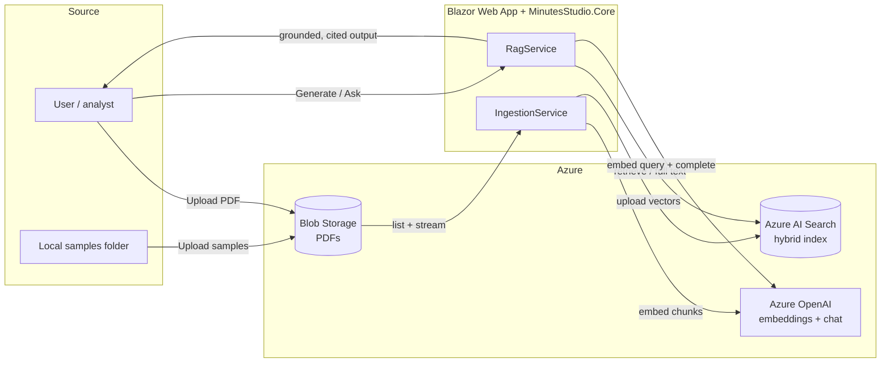
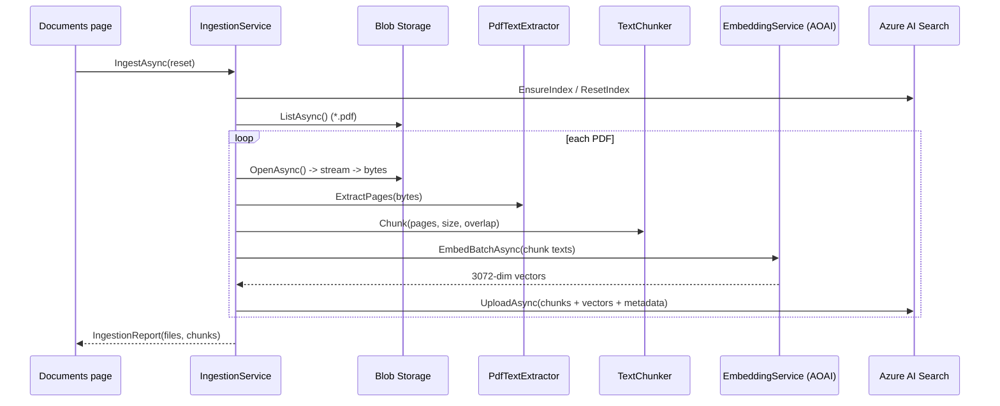
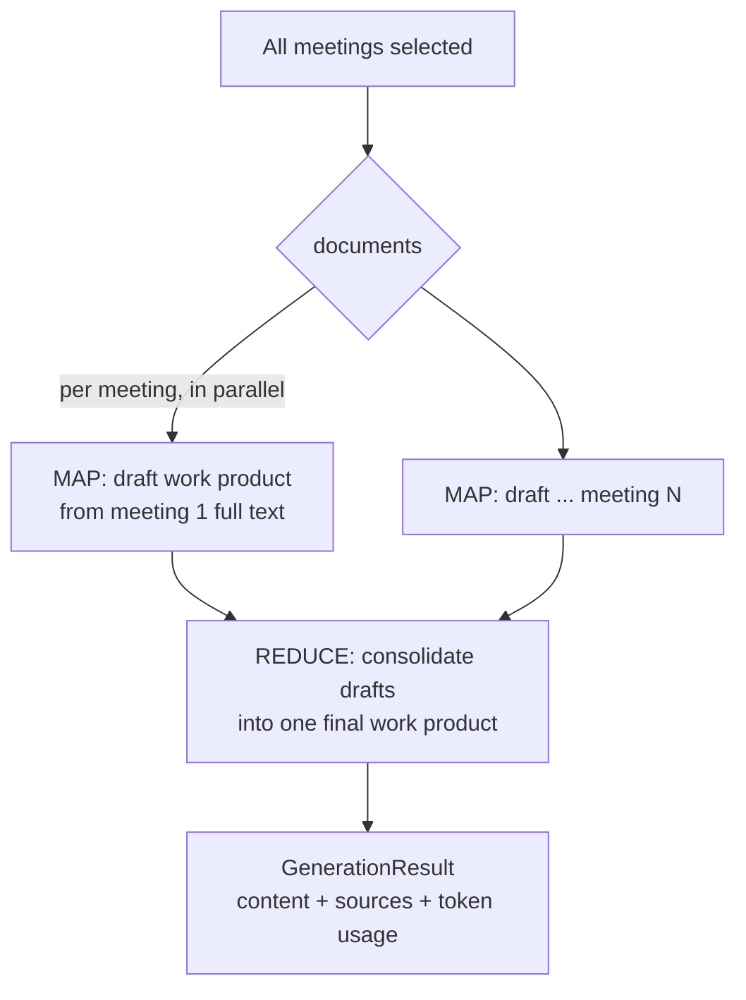
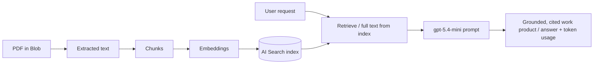

# Minutes Studio — Data Architecture

A prototype Retrieval-Augmented Generation (RAG) application that ingests meeting-minute PDFs and
generates analyst **work products** (stakeholder briefs, executive talking points, plain-language
summaries, meeting summaries) plus free-form **document chat**, all grounded in and cited back to the
source documents.

- **Frontend / host:** ASP.NET Core Blazor Web App (.NET 8, Interactive Server)
- **RAG logic:** `MinutesStudio.Core` class library
- **AI:** Azure OpenAI (Azure AI Foundry) — `gpt-5.4-mini` (chat) + `text-embedding-3-large` (embeddings)
- **Vector store:** Azure AI Search (hybrid keyword + vector)
- **Document store:** Azure Blob Storage (source PDFs)

---

## 1. Services involved

### Azure services

| Service | Role | Notes |
| --- | --- | --- |
| **Azure Blob Storage** | Source of truth for the raw PDFs | Container `minutesstudio-samples`; app can seed from local samples or accept uploads |
| **Azure OpenAI (Foundry)** | Embeddings + text generation | `text-embedding-3-large` (3072-dim) and `gpt-5.4-mini`; API pinned to `2024-10-21` |
| **Azure AI Search** | Vector + keyword index | Hybrid search (BM25 + HNSW vectors); index `minutesstudio-minutes` |

### Application services (`MinutesStudio.Core`)

| Service | Responsibility |
| --- | --- |
| `IBlobDocumentSource` / `BlobDocumentSource` | List + stream PDFs from Blob; upload samples / single files |
| `IPdfTextExtractor` / `PdfTextExtractor` | Extract page-by-page text from PDF bytes (PdfPig) |
| `ITextChunker` / `TextChunker` | Sliding-window chunking with overlap, preserving page ranges |
| `IEmbeddingService` / `AzureOpenAIEmbeddingService` | Batch-embed text via Azure OpenAI |
| `ISearchService` / `AzureSearchService` | Create/reset index, upload chunks, hybrid/vector query, list docs |
| `IGenerationService` / `AzureOpenAIGenerationService` | Chat completions; returns text **+ token usage** |
| `IIngestionService` / `IngestionService` | Orchestrates extract → chunk → embed → index |
| `IRagService` / `RagService` | Work-product generation (incl. map-reduce) and chat Q&A |
| `IConnectionChecker` / `ConnectionChecker` | Preflight health probe of all three dependencies |
| `AzureErrorHelper` | Maps SDK exceptions to actionable messages |
| `Retry` | Exponential-backoff retry for transient (incl. intermittent 404) failures |

### HTTP surface (`MinutesStudio.Web`)

- **UI pages:** `/` (Work Products), `/chat` (Document Chat), `/ingest` (Documents & Indexing), `/prompts`
- **JSON API:** `POST /api/ingest`, `POST /api/blob/upload-samples`, `GET /api/workproduct`, `GET /api/ask`, `GET /api/health`

---

## 2. High-level data flow

---

## 3. Ingestion pipeline

Triggered from the **Documents & Indexing** page (or `POST /api/ingest`). Reads from Blob Storage only.

**Chunking defaults** (`RagOptions`): `ChunkSizeChars = 3500`, `ChunkOverlapChars = 400`. Chunks keep
`PageStart`/`PageEnd` so citations can reference page ranges. Document `Title` and `MeetingDate` are
derived from the filename.

---

## 4. Work-product generation

From the **Work Products** page (or `GET /api/workproduct`). Two strategies depending on scope:

### Single meeting — full-text generation
Loads the **entire** document's chunks from the index (not just top-k snippets) so facts like vote
tallies stay intact, then runs the work-product prompt once.

### All meetings — map-reduce

- **MAP:** each meeting is summarized independently from its full text (parallelized).
- **REDUCE:** the per-meeting drafts are consolidated by a dedicated reduce prompt.
- This avoids cross-meeting fact bleed (e.g. conflated vote counts) and scales past a single prompt.

**Token accounting:** `GenerationResult.Usage` sums input/output tokens across *every* call
(all MAP drafts + the REDUCE), surfaced as an `in / out` badge in the UI.

---

## 5. Document chat (Q&A)

From the **Chat** page (or `GET /api/ask`). Scope determines retrieval:

- **Single document:** uses that document's full text (best for pointed questions).
- **All documents:** embeds the question, runs **hybrid** search (BM25 + vector) for the top-`k`
  passages (`RagOptions.TopK = 6`).

The retrieved passages are formatted into a labeled, citeable context block and sent with the chat
system prompt; the answer is returned with its source passages.

---

## 6. Retrieval / index model

Each indexed record is a **chunk** (`SearchIndexDocument`):

| Field | Purpose |
| --- | --- |
| `id` | Stable key: `{sanitized-file}_{chunkIndex}` |
| `content` | Chunk text (BM25 keyword field) |
| `contentVector` | 3072-dim embedding (HNSW vector field) |
| `sourceFile`, `title`, `meetingDate` | Document metadata / citations |
| `chunkIndex`, `pageStart`, `pageEnd` | Ordering + page-range citations |

The index (`minutesstudio-minutes`) is created with an HNSW vector profile and supports **hybrid** queries —
combining keyword and vector scoring, which is more robust than either alone for short analyst queries.

---

## 7. Resilience & error handling

- **Transient-fault retry (`Retry`)** — wraps embedding and chat calls with exponential backoff.
  Treats `408/429/5xx`, network errors, **and `404`** as transient: this Foundry resource
  intermittently returns `404 DeploymentNotFound` for deployments that actually exist.
- **Pinned API version** — the Azure OpenAI client is pinned to `2024-10-21`; older versions 404 for
  the embedding deployment on this resource.
- **Actionable errors (`AzureErrorHelper`)** — SDK exceptions are mapped to plain messages
  (`401/403` → auth, `404` → missing/provisioning, `429` → throttled, `5xx` → transient).
- **Connection preflight (`IConnectionChecker`, `GET /api/health`)** — probes embeddings, chat, and
  search and reports each OK/failed with timing, so issues are visible before ingestion.

---

## 8. Configuration & security

### Configuration keys
| Section | Keys |
| --- | --- |
| `AzureOpenAI` | `Endpoint`, `ApiKey` (secret), `ChatDeployment`, `EmbeddingDeployment`, `EmbeddingDimensions` |
| `AzureSearch` | `Endpoint`, `ApiKey` (secret), `IndexName` |
| `AzureBlob` | `ConnectionString` (secret), `ContainerName` |
| `Rag` | `ChunkSizeChars`, `ChunkOverlapChars`, `TopK`, `SamplesPath` |

- **Non-secret defaults** live in `appsettings.Development.json` (deployment/index/container names).
- **Secrets** (keys, connection strings) live in **.NET user-secrets** locally and are never committed.

### Auth model
- **Current (prototype):** API keys / connection strings for all three Azure services. Client
  factories fall back to `DefaultAzureCredential` when no key is supplied.
- **Planned (Phase 5):** Entra ID auth on the app + **managed identity** to Azure OpenAI, Search, and
  Blob (removing keys). `DefaultAzureCredential` handles token acquisition/refresh automatically.

---

## 9. End-to-end summary

